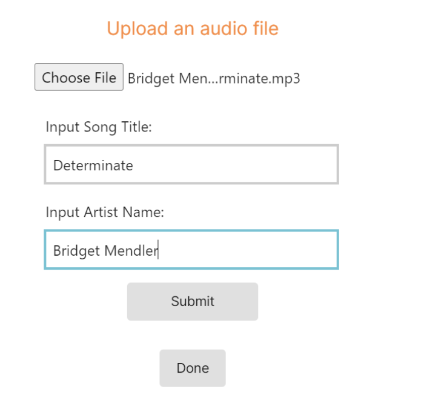

# CS 4530 Final Report
Nickhil Tekwani, Tanya Kler, Alex Les, Gerri Fox

4/25/2022

## Feature Overview

1. Enter into/start an active conversation area
2. Click the “Connect Audio” that appears within the social sidebar

3. If you are the first in the conversation area, you should see “You are the HOST” at the top, if not, then that will read “You are a LISTENER”

4. Click the “Add Song” button

5. Press the “Choose file” button and select a local MP3 file from your file system

6. Input the song’s title and artist’s name and click submit then done

7. View the requests and you should see your song added to the bottom of the list

8. If you are the host, you can accept or reject each request. Accept a request and watch it move to the bottom of the queue

9. At the top of this popup, you can see the current song playing. If you are the host, you can interact with the controls and play or pause the song, or repeat the last song or skip to the next song.

## Technical Overview

We created a new menu button that lives in the social sidebar and syncs with the current Player’s movement in and out of conversation areas. If a player is within a conversation area, the “Connect Audio” button will appear beneath the list of players in that current conversation area in the social sidebar. The “Connect Audio” button then opens a popup that consists of firstly a message informing the user if they are the host or just a listener. One becomes the host if they are the first to enter a conversation area, or if all of the players who entered prior have left. Then, it shows the current song playing with play/pause, back and skip buttons if you are the host. For everyone, there is an “Add Song” button which allows players to upload an MP3 and send it as a request to the host to be played. Upon pressing this button, a popup opens that has a button to upload a file which opens the player’s local file system and allows them to select an MP3 file to open. Once uploaded, they are prompted to type the song’s title and artist. Once these are all inputted, they can then submit it as a request and this popup will disappear. The host then has the ability to accept or reject song requests and upon acceptance, they will be added to the end of the queue. Then, they see the queue and if you are the host, you will see the requests and have the ability to accept or reject. We felt like this button should be synced to player movement in and out of conversation areas as this feature is only available from within a conversation area. Further, it makes sense within the social sidebar so you can easily see this option and with whom you would be sharing music with. 

For file uploading, upon submission of a file, the file itself is uploaded to an AWS S3 bucket that is publicly accessible, so the upload returns a link that when inputted into a browser will play the contents of the MP3 file. AWS S3 was the perfect choice for this functionality and it can handle large uploads as well as provides a simple storage unit for these files directly as it is familiar with to accept MP3 audio types. 

To create the music player itself, we used React hooks and useStates to keep track of the current song playing and to change music sources when a song ends, is skipped, or is skipped back to. The music player uses the links provided by the AWS S3 bucket to generate the audio that can be heard by the players. The url of each audio file is stored in a Song object with other relevant information that appears in the queue, such as the song title, artist, and the username of the person who requested it.

The frontend queue component consists of two lists of Song objects: a list of songs to be played, and a list of pending requests. Both of these lists are visible to all the players in the conversation area, however, the area host has access to buttons that allow them to accept requests, reject requests, or remove the top song from the queue. This functionality is enabled by React hooks that provide information from the backend, as well as useStates and useEffects that enable dynamic updates for the positions of songs in the queue.

To differentiate between hosting privileges and listener privileges to users, we needed to have different UI views for each. In the frontend files we checked whether the player was a host or not to figure out what aspects of the view to show the user. For example, a host can control the music being played by pausing/playing and skipping to the next song. A host can also accept or reject songs in a queue. Listeners can only see the current song being played without being able to change it. They can also only see the queue but have no control over whether songs are skipped or not. To implement this, we added a boolean field to the Player class called isHost which represented whether the player was a host or not and updated continuously.

In terms of styling, every additional frontend file that represented a portion of the interactions a user would go through in order to use our feature had a separate file just for the css styling. These styling files hosted all of the styling used to make our feature more sleek and inviting for users. The color scheme we chose was orange and blue to convey a sense of brightness and fun. The layout is spaced out to make the functionality available to users easy to digest and complete. The rounded corners on buttons and the music player along with the sans serif typeface give a more modern feel to the application. While the styling does not match the initial rough design sketch we had planned, the layout of the features (telling the user whether they are the host or not, showing the song playing currently, adding songs to a queue, and showing the queue) are the same and the overall minimalistic and clean aesthetic was achieved.

## Frontend Changes

## Backend Changes

## Workflows Changes

# Covey.Town ReadME

Covey.Town provides a virtual meeting space where different groups of people can have simultaneous video calls, allowing participants to drift between different conversations, just like in real life.
Covey.Town was built for Northeastern's [Spring 2021 software engineering course](https://neu-se.github.io/CS4530-CS5500-Spring-2021/), and is designed to be reused across semesters.
You can view our reference deployment of the app at [app.covey.town](https://app.covey.town/) - this is the version that students built on, and our [project showcase](https://neu-se.github.io/CS4530-CS5500-Spring-2021/project-showcase) highlights select projects from Spring 2021.

The figure above depicts the high-level architecture of Covey.Town.
The frontend client (in the `frontend` directory of this repository) uses the [PhaserJS Game Library](https://phaser.io) to create a 2D game interface, using tilemaps and sprites.
The frontend implements video chat using the [Twilio Programmable Video](https://www.twilio.com/docs/video) API, and that aspect of the interface relies heavily on [Twilio's React Starter App](https://github.com/twilio/twilio-video-app-react). Twilio's React Starter App is packaged and reused under the Apache License, 2.0.

A backend service (in the `services/townService` directory) implements the application logic: tracking which "towns" are available to be joined, and the state of each of those towns.

## Running this app locally

Running the application locally entails running both the backend service and a frontend.

### Setting up the backend

To run the backend, you will need a Twilio account. Twilio provides new accounts with $15 of credit, which is more than enough to get started.
To create an account and configure your local environment:

1. Go to [Twilio](https://www.twilio.com/) and create an account. You do not need to provide a credit card to create a trial account.
2. Create an API key and secret (select "API Keys" on the left under "Settings")
3. Create a `.env` file in the `services/townService` directory, setting the values as follows:

| Config Value            | Description                               |
| ----------------------- | ----------------------------------------- |
| `TWILIO_ACCOUNT_SID`    | Visible on your twilio account dashboard. |
| `TWILIO_API_KEY_SID`    | The SID of the new API key you created.   |
| `TWILIO_API_KEY_SECRET` | The secret for the API key you created.   |
| `TWILIO_API_AUTH_TOKEN` | Visible on your twilio account dashboard. |

### Starting the backend

Once your backend is configured, you can start it by running `npm start` in the `services/townService` directory (the first time you run it, you will also need to run `npm install`).
The backend will automatically restart if you change any of the files in the `services/townService/src` directory.

### Configuring the frontend

Create a `.env` following the .env.example file in the `frontend` directory, with the following lines:

| Config Value                  | Description                                   |
| ----------------------------- | --------------------------------------------- |
| `REACT_APP_TOWNS_SERVICE_URL` | http://localhost:8081                         |
| `REACT_APP_ACCESS_KEY_ID`     | View report/secrets for AWS Access Key        |
| `REACT_APP_AWS_SECRET_KEY`    | View report/secrest for AWS Secret Access Key |

Excluded these AWS keys from the Github readme for security purposes but these connect to the correct AWS S3 bucket that has a completely public policy. If you would like to make one under your own AWS account, create a new S3 bucket and call it “mp3-file-uploader-test” and make sure to enable complete public accessibility, and then you can generate your own AWS access and secret keys for your account and include them in the .env file. These keys are also configured as Github secrets in this repository.

### Running the frontend

In the `frontend` directory, run `npm start` (again, you'll need to run `npm install` the very first time). After several moments (or minutes, depending on the speed of your machine), a browser will open with the frontend running locally.
The frontend will automatically re-compile and reload in your browser if you change any files in the `frontend/src` directory.
